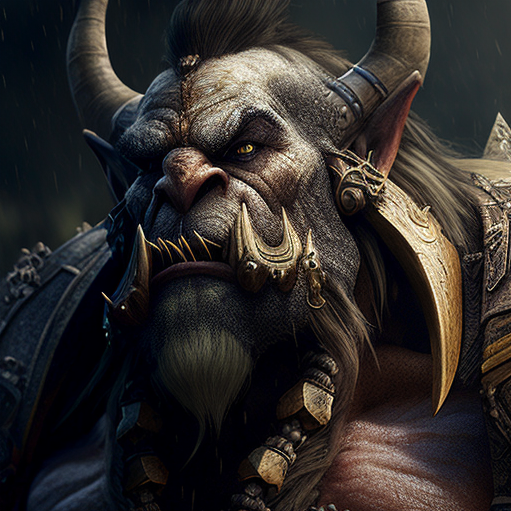

# GUS-08 Users Definition
_Users list, types of users, and users data definition_

## Definition
As a development team, we need to define and store all the users and their data that will be used on the authentication mecanisms of the application. 

## Details
There are two kinds of users:
* **Overseers** (managers): users that can configure the application parameters and operate the application without limits
* **Minions** (operators): users that interact with clients and use the application with some limitations

Each user have the following data:
* **Name**: must be unique and will be used on the login. Only letters and numbers must be permitted here.
* **Role**: Overseer or Minion.
* **Profile Picture**: to show on the application. 

Currently we have only two users
|Name|Role|Picture|
|--|--|--|
|Uruk|Overseer||
|Dobby|Minion||

All the users info is expected to be on the main database.

## Dependencies
None

## Acceptance Criteria
* As a development team we have a way to store and retrieve all the defined user info.
* All the defined users are stored with their corresponding data.
* All the user types are defined and stored as well.

Aditionally remember that all user stories must also comply the [General Acceptance Criteria](../generalAcceptanceCriteria.md)

## Definition of Done
The following conditions must be meet to consider this user story as done:
* All the users data is stored into the main database.

---
[Back to Epic](GEP-02-Security.md)  
[Back to Index](../../README.md)
