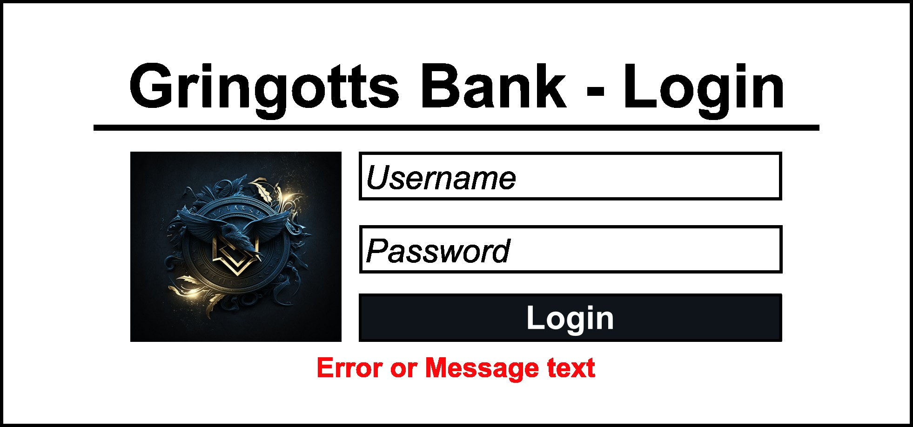
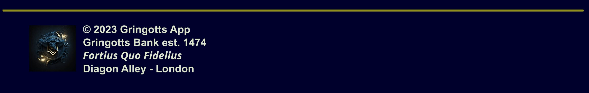

# GUS-10 Login Page
_Login Page_

## Definition
As an application user I need a login page in order to authenticate myself.

## Details

This page must contain a simple login dialog centered on the screen and a simple footer.

The login section must include:
* This title: "Gringotts Bank - Login"
* The gringotts logo
* Username and Password fields (password field content must be hidden)
* A "Login" button
* A error text if needed

The login section should follow this mockup:

<figure align="center">
 
<figcaption>Login Screen Detail</figcaption>
</figure>

The footer should have the app logo and the following text:

&copy; 2023 Gringotts App <br>
Gringotts Bank est. 1474 <br>
*Fortius Quo Fidelius* <br>
Diagon Alley - London 

The footer section should follow this mockup:

<figure align="center">
 
<figcaption>Footer Detail</figcaption>
</figure>

On a successfull login the app you forward to the main page.

On a unsuccessfull login due invalid user or password, the following message must be printed: "Invalid Credentials".

On a unsuccessfull login due any other reaseon, the following message must be printed: "An error has occurred".

If the user was already logged in, this page must redirect to the main page.

```
Suggestions 

The footer will be used on all the pages of the application.

If you are using a component based framework, ensure to use a proper design for reutilization.
```

## Dependencies
The [Authentication API](GUS-09-Authentication-API.md) is used on this page.

## Acceptance Criteria
* The Login page publicly available.
* On a unsuccessfull login, the correct error message should be printed on the page.
* On a successfull login, the page should redirect to the main page.
* All the configured users can login successfully with the correct credentials.

Aditionally remember that all user stories must also comply the [General Acceptance Criteria](../generalAcceptanceCriteria.md)

## Definition of Done
The following conditions must be meet to consider this user story as done:
* The Login Page is deployed.

---
[Back to Epic](GEP-02-Security.md) <br>
[Back to Index](../../README.md)
