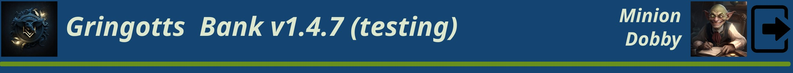
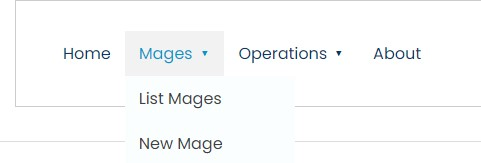

# GUS-11 Main Page
_Main Page with logged user information_

## Definition
As an application user I need a main page that shows the current logged user info and a navigation menu to access all the authorized features.

## Details
The main page consist in four different secions:

### Header
Placed on the top of the screen, must show the following information:
* App Logo
* App Name (title) 
* Current Version and Environment
* User Role
* User Name
* User profile picture
* Logout menu or icon

The header should follow this mockup:

<figure align="center">
 
<figcaption>Header Detail</figcaption>
</figure>

The logout icon must disconect the user and redirect to the login screen.

### Navigation
The navigation bar or menu must have all the links to the authorized pages for the logged user.

<figure align="center">
 
<figcaption>Navigation Menu Example</figcaption>
</figure>

The navigation must be divided by sections with related features.

For the moment only "Home" option linking this same page.

Must also contain the current location.
<figure align="center">
 
<figcaption>Location Example</figcaption>
</figure>

### Content
The main page content section must contain only the Gringotts logo centered with a considerable size.

### Footer
The same defined on the login page

<figure align="center">
 
<figcaption>Footer Detail</figcaption>
</figure>


```
Suggestions 

Most of the sections defined on this story will be used on the rest of the application, in fact the only section that will change from page to page is the "Content" section.

If you are using a component based framework, ensure to use a proper design for reutilization.
```

## Dependencies
The information given by the [Authentication API](GUS-09-Authentication-API.md) is used on the header section.

## Acceptance Criteria
* The Main page publicly available, for any authenticated user.
* The user information on the header must coincide with the authenticated user.
* The logout option must disconnect the user and redirect to the login screen.
* The navigation section must show only the authorized sections for the authenticated user.
* The locacion section must show the current location on the app.

Aditionally remember that all user stories must also comply the [General Acceptance Criteria](../generalAcceptanceCriteria.md)

## Definition of Done
The following conditions must be meet to consider this user story as done:
* The Main Page is deployed.

---
[Back to Epic](GEP-02-Security.md) <br>
[Back to Index](../../README.md)
