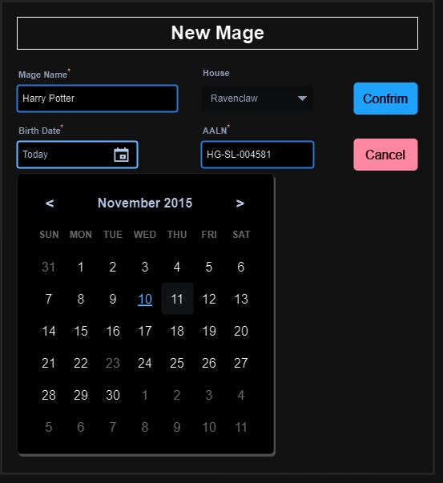

# GUS-12 New Mage
_New mage creation in the application_

## Definition
As an Overseer User, I need a page to create new mages in the application.

## Details

The Mages are the clients of Gringotts, they have a rich variety of information that must be stored into the application in order to operate.

Each Mage who studied on Hogwarts, belongs to a House. These houses are:
* Gryffindor 
* Hufflepuff
* Ravenclaw 
* Slytherin

Mages who studied on a different school are uncommon on Gringotts and will be considered that belogns to 'Other' house.

Each Mage has a Arcane Authorizacion Licence Number (or AALN), which uniquely identifies them and follows this format:

 <b>SS-HH-NNNNNN</b> 

Where:
* SS identifies the School, for Hogwatrs, the code is 'HG', for others, it is 'OT'.
* HH identifies the House, 'GR' for Gryffindor, 'HU' for Hufflepuff, 'RA' for Ravenclaw and 'SL' for Slytherin. (OT for other Schools)
* NNNNNN is a 6-digit identifier unique among all mages from all schools and houses.

_For example: HG-SL-004581 is the AALN for a mage that belongs to Slytherin._

The application must ensure that the AALNs are valid.

Other important information about mages that must be stored si the following:
* **Full Name**, doesn't need to be unique, duplicate names can exists with different AALN.
* **Date of Birth**, only mages older than 16 years are allowed to have an account on Gringotts.

The page section should follow this mockup:

<figure align="center">
 
<figcaption>New Mage Form</figcaption>
</figure>

The day picker should only be visible when selecting the birth date

The Cancel Button must redirect to the previous page.

The Confirm Button must validate the data. If any validation fails, a clear error message must be displayed. If all validations pass, a success message must be shown, and the application must redirect to the previous page.

## Validations

The following validations must be implemented for this feature
* All fields are mandatory
* The house must be one of the following values:
  * Gryffindor 
  * Hufflepuff
  * Ravenclaw 
  * Slytherin
  * Other
* The birth date must be at least 16 years from the current date
* The numeric part of the AALN must be unique

## Dependencies
None

## Navigation and Security
In the navigation section this feature access must be on the following route:

**Mages -> New Mage**

This feature must be only accesible for users with the Overseer Role.

## Acceptance Criteria
* As an authenticated Overseer user, I have access to this page.
* As an authenticated Minion user, I don't have access to this page.
* As an Overseer user, I can create a new mage with all the required information.
* All Mage attributes are validated to ensure consistent data.

Aditionally remember that all user stories must also comply the [General Acceptance Criteria](../generalAcceptanceCriteria.md)

## Definition of Done
The following conditions must be met to consider this user story as done:
* The page is deployed.
* An access control mechanism is implemented to ensure that this functionality is only accessible to Overseer Users in both the Front-End and Back-End layers.
* Validation rules for each field are implemented in both Front-End and Back-End layers.
* All validation and error messages are clear and meaningful to users in the application.
* On successful Mage creation, a clear and meaningful message is displayed.

---
[Back to Epic](GEP-03-Mages.md)  
[Back to Index](../../README.md)
