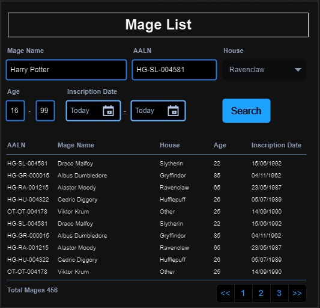

# GUS-13 Mages List
_Mages List with search funcionalities_

## Definition
As an application user, I need a page to list all the mages in the application with filters and search functionalities, in order to find specific mages.

## Details

The list must be on **table format** with the following fields in order:
* AALN
* Full Name
* House
* Age
* Inscription Date

The default ordering is the Full Name alphabetically ascending.

There must be a functionality to order the results by any field either in ascending or descending order.

The results must be paginated in pages of 25, with navigation controls displaying the total pages and total mages.

The page must have the following filters:
* A search box with free text that aplies only for the mage name, case-insensitive and partial results.
* A search box for the AALN with exact results only
* A house select drop list 
* Age numerical range filter
* Inscription Date range filter

The filter form must be above the results table.

Filters must be applied only after pressing a "search" button.

All filters can be used at the same time, and they are inclusive.

The page must initially display results with no applied filters.

If the filters result in no matches, an empty table must be displayed.

The page section should follow this mockup:

<figure align="center">
 
<figcaption>Mage List Page</figcaption>
</figure>

## Dependencies

* The main mages structures are defined and implemented on the [New Mage](GUS-12-New-Mage.md) user story.

## Navigation and Security
In the navigation section this feature access must be on the following route:

**Mages -> Mages List**

This feature must accesible for users with the Overseer Role or the Minion Role.

## Acceptance Criteria
* Authenticated Overseer or Minion users have access to this page.
* The page initially displays all mages without any applied filters.
* All filters function correctly, and the results are consistent.

Aditionally remember that all user stories must also comply the [General Acceptance Criteria](../generalAcceptanceCriteria.md)

## Definition of Done
The following conditions must be met to consider this user story as done:
* The page is deployed.
* An access control mechanism is implemented to ensure that this functionality is only accessible to Overseer or Minions Users in both the Front-End and Back-End layers.
* All filter functionalities work correctly on the web application, showing consistent results.

---
[Back to Epic](GEP-03-Mages.md)  
[Back to Index](../../README.md)
