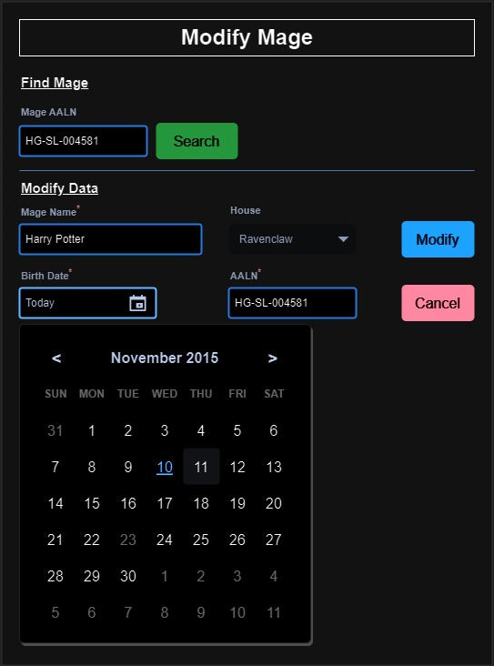
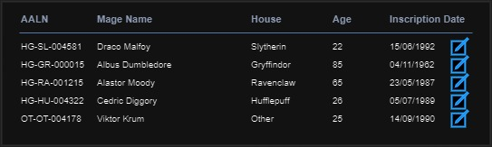

# GUS-14 Modify Mage
_Modify existing mage data_

## Definition
As a Overseer User, I need a page to modifify the data of an existing mages in the application.

## Details
The following mage attributes can be modified:
* AALN
* Name
* House
* Birth Date

When updating the mage information, **the same validations from the creation must be applpied**.

In order to modify a mage, the exact mage must be identified. This must be done using a search field for the Mage AALN, accepting only exact matches, or the page can start pre-queried with an exact mage if coming from another page.

On the Mages List page, an icon must be added to each row of the results table that enables the user to modify that particular mage using this page. This icon must be visible only for the users with the Overseer role.

The page section should follow this mockup:

<figure align="center">
 
<figcaption>Modify Mage Form</figcaption>
</figure>

This page is divided in two sections, the search form and the modify form.

If the page isn't pre-queried, on load, only the search section must be visible. After a successful search, the modify section is displayed with the found mage's current info. If the search wasn't successful, a clear message must be displayed, and the modify section must not be visible.

The day picker should only be visible when selecting the birth date

The Cancel Button must redirect to the previous page.

The Modify Button must validate the data. If any validation fails, a clear error message must be displayed. If all validations pass, a success message must be shown, and the application must redirect to the previous page.

If the page is pre-queried, it should behave the same way as if the correct AALN is searched.

The mage list page modification is expected to follow this mockup:

<figure align="center">
 
<figcaption>List Mage Detail</figcaption>
</figure>

Clicking on the modify icon must link to the Modify Mage page pre-queried with that record's mage.

## Validations

The following validations must be implemented on the modify section
* All fields are mandatory
* The house must be one of the following values:
  * Gryffindor 
  * Hufflepuff
  * Ravenclaw 
  * Slytherin
  * Other
* The birth date must be at least 16 years from the current date
* The numeric part of the AALN must be unique

```
Suggestions 

The modify section is almost the same from the New Mage page, take in consideration that you can use the same component.
```

## Dependencies
* The [New Mage](GUS-12-New-Mage.md) feature must be completed.
* The [Mages List](GUS-13-Mages-List.md) page must be implemented.

## Navigation and Security
In the navigation section this feature access must be on the following route:

**Mages -> Modify Mage**

This feature must be only accesible for users with the Overseer Role.

## Acceptance Criteria
* As an authenticated Overseer user, I have access to this page from the navigation bar.
* As an authenticated Overseer user, I have access to this page from the Mage List page with the mage info pre-queried.
* As an authenticated Minion user, I don't have acecss to this page by any means.
* As an Overseer user, I can modify an existing mage with all the required information.
* All Mage attributes are validated to ensure consistent data.

Aditionally remember that all user stories must also comply the [General Acceptance Criteria](../generalAcceptanceCriteria.md)

## Definition of Done
The following conditions must be met to consider this user story as done:
* The page is deployed.
* An access control mechanism is implemented to ensure that this functionality is only accessible to Overseer Users in both the Front-End and Back-End layers.
* Validation rules for each field are implemented in both Front-End and Back-End layers.
* All validation and error messages are clear and meaningful to users in the application.
* On successful Mage modification, a clear and meaningful message is displayed.

---
[Back to Epic](GEP-03-Mages.md) <br>
[Back to Index](../../README.md)
