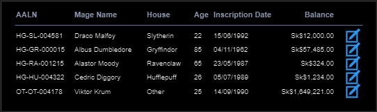

# GUS-16 Account Balance
_Account definition and balance calculation_

## Definition
As an Overseer or Minion User, I need a functionality to view a particular mage's current account balance.

## Details

Accounts is one of the core funciontalities of Gringogtts.

Each Mage must have an account asociated, and can have **only one account** asociated.

An Account consist in a series of movements or **Transactions**. Each transaction have the following info:
* A timestamp indicating the exact moment of the transaction.
* A concept, subject or **Transaction Type**, used to categorize the nature of a transaction.
* An amount, that can be positve or negative, depending on the transaction type.

The **Account Balance** at a certain point in time, is the result of appling all the transactions up to that point. The Current Account Balance refers to the balance in this precise moment, considering all the existing transactions, and represents the current avaliable money on that account.

There are 3 basic transactions types to consider at this point:
|Code|Name|Direction|Description|
|--|--|--|--|
|OPE|Account Opening|Incoming|Represents the initial deposit made when an account is opened, this is an incoming transaction and must have a positive amount|
|MPL|Magical Placement|Incoming|Represents a regular deposit, this is an incoming transaction and must have a positive amount|
|MRE|Magical Retrieval|Outgoing|Represents a regular withdraw, this is an Outgoing transaction and must have a negative amount|

There is an example:
|Date and Time|Code|Type|Amount|Balance|
|--|--|--|--:|--:|
|2023-10-15 14:54|OPE|Account Opening|Sk$12,000.00|Sk$12,000.00|
|2023-10-17 08:37|MPL|Magical Placement|Sk$547.00|Sk$12,547.00|
|2023-10-21 10:15|MRE|Magical Retrieval|-Sk$2,635.00|Sk$9,912.00|
|2023-11-05 20:24|MPL|Magical Placement|Sk$3,465.00|Sk$13,377.00|

The ammounts and balance are allways represented in **Sickles**, the preopsition symbol is **Sk$**, and must follow this format: **$999,999.00**.


```
Suggestions 

When Modeling this feature, pay special attention to the fact that each mage can have one and only one account.
```

### New Mage modifications
When opening an account an initial deposit is required with a minimal amount:
* Sk$2,000 for hogwarts mages
* Sk$5,000 for other school mages

The New Mage operation must implement this validations and transaction. The user interface must accept Knuts, Sickles or Galleon in any combination, but the transaction must be allways recorded on Sickles, following this transformation table:

|Currency|Value in Knuts|Value in Sickles|Value in Galleons|
|--|--:|--:|--:|
|Knut|1|0.0344827586206897|0.0020283975659229|
|Sickle|29|1|0.0588235294117647|
|Galleon|493|17|1|

### Transactions vs Operations
There is a difference between these two terms. A **transaction**, as stated before, is a single movement in a mage account. An **operation** is a business action that can consist of multiple transactions. For example, a *deposit* is an operation that results in a single incoming transaction, but a *transfer* is an operation that results in an outgoing transaction from an account and an incoming transaction into a different account. 

### Migrated Data
The [mages data migration](../GEP-03-Mages/GUS-15-Mages-Migration.md) includes a file with the current balance of each migrated mage. All the migrated mages must have a transaction with that balance, the migration date and time and the transaction type: **MIG, Account Migration**.

### Mages List modification
The current balance must be visible on the mages list table following this mockup:
<figure align="center">
 
<figcaption>Mages List with balance</figcaption>
</figure>

## Dependencies
None

## Acceptance Criteria
* As an Overseer user, I can specify the initial deposit when creating a new mage, with the given validations.
* As an Overseer or Minion user, I can see the current account balance for each mage on the Mages List page.
* All the migrated mages have their balances migrated as well.

Aditionally remember that all user stories must also comply the [General Acceptance Criteria](../generalAcceptanceCriteria.md)

## Definition of Done
The following conditions must be met to consider this user story as done:
* The New Mage feature have all the changes implemented and deployed in all layers.
* The Mages List feature have all the changes implemented and deployed in all layers.
* All the migrated Mages have their accounts updated with the correct balance.

---
[Back to Epic](GEP-04-Accounts.md) <br>
[Back to Index](../../README.md)
