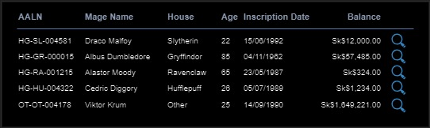

# GUS-17 Transactions History
_Detailed chronological list of all historical transactions_

## Definition
As an Overseer or Minion User, I need a page to view a particular mage's detailed info including the complete list of historical transactions.

## Details

This page is divided into 4 sections
* Search Form
* General Info
* History Filters
* Transactions History

There is a general mockup of the page:

<figure align="center">
 
<figcaption>Mage Detail Screen</figcaption>
</figure>

This page is expected to behave similarly to how the modify mage currently works: it can start pre-queried or empty. If not pre-queried, only the find mage section must be visible. On a successful search, the rest of the sections must be displayed with the corresponding info with no filters applied; on an unsuccessful search, the rest of the sections must be hidden, displaying a clear message. If the page is pre-queried, it should behave the same way as if the correct AALN is searched.

The general info section must display the following fields:
* AALN
* Mage Name
* House
* Birth Date
* Inscription Date
* Current Balance

If the user has the Overseer Role, an 'Edit' icon must be displayed, linking to the Modify Mage page with this mage pre-queried.

The History Filters section must have the following filters:
* Transaction date range, including date pickers
* Transaction amount range, with fields allowing only positive or negative numbers
* Transaction type multi-select picker. This must have all the transaction types in a dropdown menu, and it must be possible to select multiple values.

All the filters are optional and must be applied as soon as they are modified.

All the filters can be used at the same time, and they are inclusive.

If the filters result in no matches, an empty table must be displayed.

The Transactions History must show all the tranactions on a table with the following fields in order:
* Date and Time
* Transaction Type Code
* Transaction Type Description
* Amount
* Balance

The results must be ordered from the newer transaction to the older transaction. The ordering can not be modified.

The results must be paginated in pages of 25, with navigation controls displaying the total pages and total movements.

There must be a feature to download the results (with the applied filters) as a csv file.

### Mages List modification
The 'edit' icon in the result table must be changed to a 'view details' icon, linking to this page instead of the modify mage page. This new icon must be visible for both Minion and Overseer roles.

<figure align="center">
 
<figcaption>Mages List</figcaption>
</figure>

## Dependencies

* The account definitions and structures  are defined and implemented on the [Account Balance](GUS-16-Account-Balance.md) user story.

## Navigation and Security
In the navigation section this feature access must be on the following route:

**Mages -> Mage Detail**

This feature must accesible for users with the Overseer Role or the Minion Role.

## Acceptance Criteria
* As an Overseer or Minion user, I have access to this page from the navigarion bar and from the Mage List page with the mage info pre-queried
* As an Overseer user, I can see the edit icon and link to the Modify Mage page.
* As a Minion user, I don't see the edit icon.
* With a Mage queried I can see all the transaction history of that mage.
* With a Mage queried all filters work propertly and the results are consistent.
* With a Mage queried I can download a csv file that contains the transaction history with the current applied filters.
* Without a Mage queried only the search section is displayed 

Aditionally remember that all user stories must also comply the [General Acceptance Criteria](../generalAcceptanceCriteria.md)

## Definition of Done
The following conditions must be met to consider this user story as done:
* The Mage Detail page is deployed in all layers.
* The Mages List page changes are implemented and deployed in all layers.
* All filter functionalities work correctly on the web application, showing consistent results.

---
[Back to Epic](GEP-04-Accounts.md)  
[Back to Index](../../README.md)
