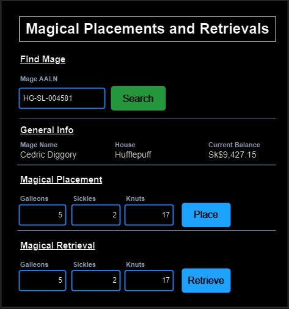

# GUS-18 Account Operations
_Magical Placements (Deposits) and Magical Retrieval (Withdraws)_

## Definition
As an Overseer or Minion User, I need a page to perform the Magical Placement and the Magical Retrieval operations.

## Details

This page is divided into 4 sections
* Search Form
* General Info
* Placement Form
* Retrieval Form

There is a general mockup of the page:

<figure align="center">
 
<figcaption>Account Operations MPL MRE</figcaption>
</figure>

This page can start pre-queried or empty. If not pre-queried, only the find mage section must be visible. On a successful search, the rest of the sections must be displayed with the corresponding info; on an unsuccessful search, the rest of the sections must be hidden, displaying a clear message. If the page is pre-queried, it should behave the same way as if the correct AALN is searched.

The general info section must display the following fields:
* AALN
* Mage Name
* House
* Current Balance

Both, the Placement and Retrieval Form have the same structure:
* A field for each currency value: Galleons, Sickles and Knuts
* A button to perform the operation

All the currency fields must receive only numerical non-decimal positive values. The transaction must be recorded in Sickles, and the transformation must be done using the table defined in the [Account Balance](GUS-16-Account-Balance.md) user story. Each transaction must have the correct transaction type, and the current timestamp as the transaction date and time.

There are no validations nor restrictions on how much money a mage can place.

As a general rule, a mage cannot have a negative account balance, so an overdraft is usually forbidden. In other words, a mage cannot retrieve a bigger amount than the current account balance. There are two exceptions:
* Hogwarts mages are trusted by Gringotts, so overdrafts are authorized up to -Sk$2,000 for Hogwarts mages.
* An Overseer user can bypass this restriction for any mage and any amount.

## Dependencies

* The account definitions and structures  are defined and implemented on the [Account Balance](GUS-16-Account-Balance.md) user story.

## Navigation and Security
In the navigation section this feature access must be on the following route:

**Operations -> Magical Placements and Retrievals**

This feature must accesible for users with the Overseer Role or the Minion Role.

## Acceptance Criteria
* As an Overseer or Minion user, I have access to this page from the navigation bar.
* As an Overseer or Minion user, I can select a mage to perform account operations.
* As an Overseer or Minion user, I can perform a Magical Placement using any combination of currencies without any restriction.
* As a Minion user, I can perform a Magical Retrieval using any combination of currencies for any amount lower than the current account balance for a particular mage.
* As a Minion user, I can perform a Magical Retrieval with an overdraft up to -Sk$2,000, using any combination of currencies, for a Mage that belongs to Hogwarts School.
* As an Overseer, I can perform a Magical Retrieval using any combination of currencies without any restriction.

Aditionally remember that all user stories must also comply the [General Acceptance Criteria](../generalAcceptanceCriteria.md)

## Definition of Done
The following conditions must be met to consider this user story as done:
* The Magical Placements and Retrievals page is deployed in all layers.
* Both Operations can be performed by an Overseer or Minion user.
* Magical Retrieval validations are properly implemented according to the user performing the operation.

---
[Back to Epic](GEP-04-Accounts.md)  
[Back to Index](../../README.md)
