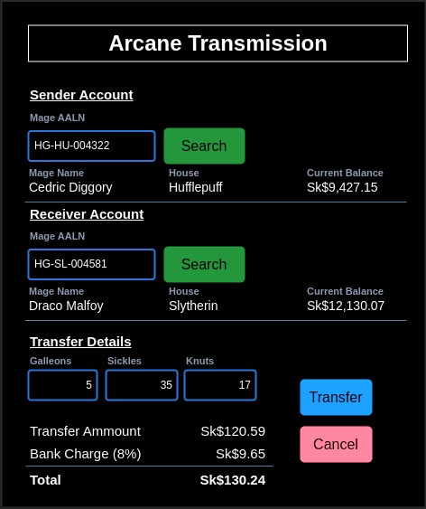

# GUS-19 Operation: Arcane Transmissions
_Transfers between mage accounts_

## Definition
As an Overseer or Minion User, I need a page to perform the Arcane Transmission operation.

## Details

An Arcane Transmission is a money transfer between two mage accounts: a sending account and a receiver account. This operation consists of three transactions: an outgoing movement from the sender, an incoming movement in the receiver, and a bank charge on the sender.

There are 2 new transactions types:
|Code|Name|Direction|Description|
|--|--|--|--|
|ATR|Arcane Transmission|Outgoing / Incoming|Represents a transfer between accounts, this is an outgoing transaction and must have a negative amount on the sender account, and a incoming transaction and must have a positive amount on the receiver account.|
|BCH|Bank Charge|Outgoing|Represents a bank charge or fee and can be related to different operations, this is an outgoing transaction and must have a negative amount.|

### Bank Charges
The Arcane Transmission operation has a bank fee that depends on the relationship between the accounts:
* Transfers between accounts of the same Hogwarts House have no fee.
* Transfers between accounts of different Hogwarts Houses have a fee of 8% of the transferred amount.
* Transfers between accounts of different Schools have a fee of 15% of the transferred amount. Transfers between 2 "Other" Schools count as different schools.

The bank charge is always applied to the sending account.

Example:

A transfer of Sk$1,000.00 from Cedric Diggory (from Hufflepuff) to Draco Malfoy (from Slytherin) incurs an 8% fee due to being in different Hogwarts houses.

Cedric's Account:
|Date and Time|Code|Type|Amount|Balance|
|--|--|--|--:|--:|
|2023-10-15 14:54|ATR|Arcane Transmission|-Sk$1,000.00|Sk$12,000.00|
|2023-10-15 14:54|BCH|Bank Charge|-Sk$80.00|Sk$11,920.00|

Draco's Account:
|Date and Time|Code|Type|Amount|Balance|
|--|--|--|--:|--:|
|2023-10-15 14:54|ATR|Arcane Transmission|Sk$1,000.00|Sk$72,950.00|

## Page Design

There is a general mockup of the page:

<figure align="center">
 
<figcaption>Arcane Transmissions</figcaption>
</figure>

This page is divided into 3 sections:
* Sender Account
* Receiver Account
* Transfer Details

Both Sender and Receiver sections have the same structure and work in the same way. There is a search mage form, using exact AALN match, and a small info section with the mage name, house and current balance. On a successful search all the fields must be filled with the corresponding info; on an unsuccessful search, the fields must be cleared displaying a corresponding message.

The transfer details section must have
* A field for each currency value: Galleons, Sickles and Knuts.
* A button to perform the operation
* A button to cancel the operation
* A list with the detail of the amounts including the transfer amount, the bank charge (indicating the corresponding percentage) and the total. The list values must be automatically updated when you change the values of each currency, and when you select a mage sender or receiver

The Cancel Button must redirect to the home page.

The Confirm Button must validate all the conditions. If any validation fails, a clear error message must be displayed. If all validations pass, the operation must be performed and a success message must be shown, and all the input fields must be cleared.

## Validations
* Both mages must be selected, and be different mages, in order to make the Arcane Transmission.
* The sender account must have sufficient funds to cover both the transfer and the associated bank charge.
* There are no exceptions that permit an overdraft for this operation.
* There is a minimal amount of 100 Sickles for each Arcane Transmission.

## Dependencies
None besides those defined on the Epic.

## Navigation and Security
In the navigation section this feature access must be on the following route:

**Operations -> Arcane Transmissions**

This feature must accessible for users with the Overseer Role or the Minion Role.

## Acceptance Criteria
* As an Overseer or Minion user, I have access to this page from the navigation bar.
* As an Overseer or Minion user, I can select both the sender and the receiver mages to perform the operation.
* As an Overseer or Minion user, I can perform a Arcane Transmission using any combination of currencies.
* All the defined validations are implemented on the operation.
* The Bank Charges are calculated correctly in each case.

Additionally remember that all user stories must also comply the [General Acceptance Criteria](../generalAcceptanceCriteria.md)

## Definition of Done
The following conditions must be met to consider this user story as done:
* The Arcane Transmissions page is deployed in all layers.
* The operation can be performed by an Overseer or Minion user.
* All the validations are properly implemented.

---
[Back to Epic](GEP-05-Arcane-Transmissions.md)  
[Back to Index](../../README.md)
