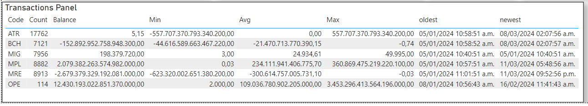

# GUS-20 Overseer Dashboard
_A dashboard with several metrics_

## Definition
As an Overseer, I need a dashboard to visualize multiple metrics and charts in order to gain insights for making better strategic decisions.

## Details
The dashboard must be on a separate page only accessible to the Overseer.

There are a total of 11 metrics that needs to be visualized on the dashboard:

### Houses Balance
A pie chart displaying the total balance for each house, representing the sum of the current balances of all mages belonging to each house.

<figure align="center">
 
<figcaption>Houses Balance</figcaption>
</figure>

### Houses Distribution
A pie chart displaying the total number of mages for each house.

<figure align="center">
 
<figcaption>Houses Distribution</figcaption>
</figure>

### Transactions per Day
A histogram or line chart showing the evolution of the number of daily transactions excluding the migrations.

<figure align="center">
 
<figcaption>Transactions per Day</figcaption>
</figure>

### Bank Earnings
A histogram or line chart showing the evolution of the daily amount of bank earnings and its accumulated value.

<figure align="center">
 
<figcaption>Bank Earnings</figcaption>
</figure>

### Top 5 Richest Mages
A table displaying the top 5 wealthiest mages and their current balances, ordered by balance.

<figure align="center">
 
<figcaption>Top 5 Richest Mages</figcaption>
</figure>

### Transactions Statistics
A table displaying information about all transactions, including the following for each transaction type:
* Transaction Code
* Total Transactions
* Current Balance
* Minimal Amount
* Average Amount
* Maximal Amount
* Oldest Datetime
* Newest Datetime

<figure align="center">
 
<figcaption>Transactions Statistics</figcaption>
</figure>

### Total Mages
A card indicating the total number of Mages

<figure align="center">
 
<figcaption>Total Mages</figcaption>
</figure>

### Total Active Mages
A card indicating the total number of Active Mages, meaning Mages that have had at least one transaction in the last 15 days.

<figure align="center">
 
<figcaption>Total Active Mages</figcaption>
</figure>

### Total Transactions
A card indicating the total number of Transactions.

<figure align="center">
 
<figcaption>Total Transactions</figcaption>
</figure>

### Latest Transactions
A card indicating the total number of latest Transactions, referring to transactions that occurred in the last 15 days.

<figure align="center">
 
<figcaption>Latest Transactions</figcaption>
</figure>

### Total Bank Earnings
A card indicating the total amount earned by the bank.

<figure align="center">
 
<figcaption>Total Bank Earnings</figcaption>
</figure>

## Page Design

The metrics do not need to be in any particular order or disposition, and no mockup is provided for this dashboard. However, there is a sample representation of what is expected.

<figure align="center">
 
<figcaption>Dashboard Sample</figcaption>
</figure>

Take in consideration that all the values representing money must be displayed in the correct format.

Each chart must load individually, and if a chart takes longer to calculate and display, a visual component such as a spinner loader or progress bar must indicate that the chart is loading.

There are no interaction requirements with any chart. Hover information is optional but not required

## Dependencies
None besides those defined on the Epic.

## Navigation and Security
In the navigation section this feature access must be on the following route:

**Metrics -> General Dashboard**

This feature must be only accessible for users with the Overseer Role.

## Acceptance Criteria
* As an authenticated Overseer user, I have access to this page.
* As an authenticated Minion user, I don't have access to this page.
* The dashboard page loads instantly and each chart is loaded after.
* Even if some charts take more time, I can see all charts as soon as they are calculated.
* All the charts information is accurate and properly displayed.

Additionally remember that all user stories must also comply the [General Acceptance Criteria](../generalAcceptanceCriteria.md)

## Definition of Done
The following conditions must be met to consider this user story as done:
* The page is deployed.
* An access control mechanism is implemented to ensure that this functionality is only accessible to Overseer Users in both the Front-End and Back-End layers.

---
[Back to Epic](GEP-06-Mystical-Insights.md)  
[Back to Index](../../README.md)
