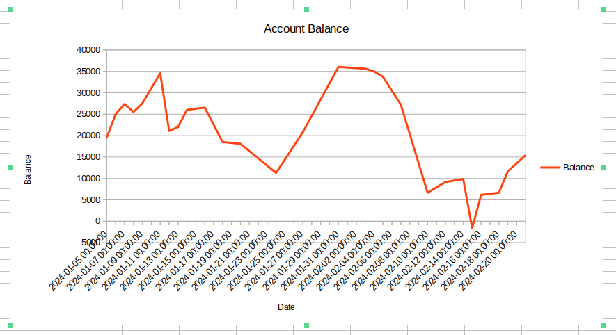

# GUS-21 Account Balance Histogram
_Account Balance History Graph on the Mage Detail page_

## Definition
As an Overseer or Minion user, I need to visualize a histogram of the account balance in the Mage Detail Page.

## Details
The histogram must be displayed alongside the balance history, and when the page is loaded, it must contain data from the entire account lifespan, from the account opening to the last transaction.

The histogram is affected by the date filters in the transaction history section. This means that if date filters are applied to the table, they must also be applied to the histogram. This only occurs for the transaction date filters; the other filters do not affect the histogram.

## Page Design

There is no specific mockup for this feature. The only requirement is that the histogram must be positioned alongside the history table, either on the left or right side. 

Here's a conceptual sample of what is expected:

<figure align="center">
 
<figcaption>Account Balance Histogram</figcaption>
</figure>

Take in consideration that all the money and dates values must be displayed in the correct format.

## Dependencies
None besides those defined on the Epic.

## Acceptance Criteria
* As an authenticated Overseer or Minion user, I can visualize the histogram on the Mage Detail Page.
* The histogram information is accurate and properly displayed.

Additionally remember that all user stories must also comply the [General Acceptance Criteria](../generalAcceptanceCriteria.md)

## Definition of Done
The following conditions must be met to consider this user story as done:
* The Mage Detail page changes are deployed.
* The showed information is correct.

---
[Back to Epic](GEP-06-Mystical-Insights.md)  
[Back to Index](../../README.md)
