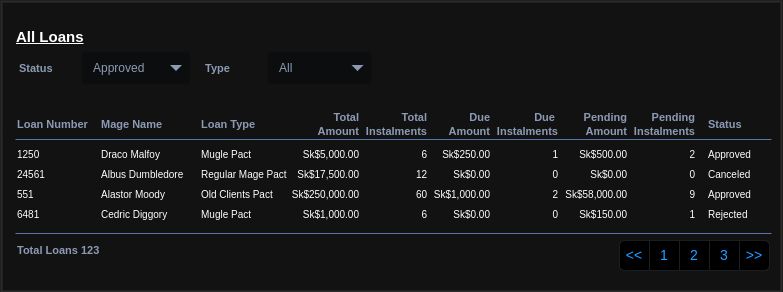

# GUS-24 Operation: Dark Pact Approvals and Rejections
_Loan Requests Approvals and Rejections_

## Definition
As an Overseer, I need a page to Approve or Reject the requested Dark Pacts.

## Details

Each Dark Pact must pass the approval of the Overseer in order to be confirmed, therefore, its initial state is "Pending" and can be Approved or Rejected by the Overseer. This is a manual choice of the Overseer user and doesn't have any validations.

The approval or rejection only updates the loan state, neither of these actions modifies the loan composition.

In order to do this, a page listing all the Dark Pacts with a status filter is needed.

## Page Design

This page is divided in two sections: 

### Pending Loans

Showing the Loans that need to be approved or rejected, with the following mockup:

<figure align="center">
 
</figure>

This table must be ordered by the Requested Date showing the oldest request first. Must display up to 10 pending loans per page.

The approval and reject actions need a confirmation dialog in each case. Each loan must be approved or rejected individually. After an approval or rejection action, the lists must be refreshed.

### All Loans

Showing all the non pending loans, with optional filters on state and loan type, following this mockup:

<figure align="center">
 
</figure>

The results must be ordered by loan number from oldest to newest, and show up to 10 loans per page.

The Total Amount column refers to the total amount of the loan, is the sum of all instalment amounts. The Due Amount and Instalments, refers to the instalments with a due date before the actual date that are not paid yet. Due calculations are ignored on rejected loans. The Pending Amount and Payments refers to the unpaid instalments.

## Dependencies

* The [Dark Pact Request](GUS-23-Dark-Pact-Request.md) user story must be implemented.

## Navigation and Security

In the navigation section this feature access must be on the following route:

**Operations -> Dark Pacts Approvals and Rejections**

This feature must be only accessible for users with the Overseer Role.

You can see a full navigation structure on the [Navigation Section](/DOC/navigation.md)

## Acceptance Criteria
* As an Overseer, I have access to this page from the navigation bar.
* As an Overseer, I can see a list of pending loans.
* As an Overseer, I can approve a pending loan.
* As an Overseer, I can reject a pending loan.
* As an Overseer, I can see a list of non pending loans.
* As an Overseer, I can optionally filter the loan list by loan type.
* As an Overseer, I can optionally filter the loan list by loan status.

Additionally remember that all user stories must also comply the [General Acceptance Criteria](../generalAcceptanceCriteria.md)

## Definition of Done
The following conditions must be met to consider this user story as done:
* The Dark Pacts Approval and Rejections page is deployed in all layers.
* The Dark Pacts Lists filters work properly.
* The Dark Pacts Lists shows proper information.

---
[Back to Epic](GEP-07-Dark-Pacts.md)  
[Back to Index](../../README.md)
