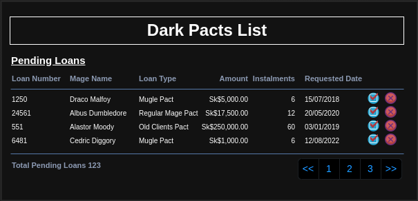

# GUS-25 Operation: Dark Pacts Instalments Payment
_Loan Details Page and Instalment Payment Operation_

## Definition
As an Overseer or Minion user, I need a page to perform an Instalment Payment for a specific Dark Pact.

## Details

In order to make an Instalment Payment, a Dark Pact Detail Page must be created. This page can start pre-queried or a specific loan can be found by the loan number (in a similar way as the Mage Detail page works).

Pending loans can't be queried on this page. If the Loan number doesn't exist in a valid state, the page must display a proper message.

The page must show a header with the general details of the loan:
* Loan Number
* Mage Number
* Loan Type
* Total Amount
* Total Instalments
* Pending Capital Amount
* Pending Interest Amount
* Pending Instalments
* Due Amount
* Due Instalments
* Status

And a table displaying all the instalments, with the following structure:
* Instalment Number
* Due Date
* Capital Amount
* Interest Amount
* Other Charges Amount
* Total Instalment Amount
* Payment Date
* Punitive Interest
* Total Paid Amount

Overdue unpaid instalments must be highlighted in some way.

Also, a pay button above the instalments list. This must show a modal dialog indicating the instalment that will be paid with the payment total and composition, confirm and cancel buttons.

### Instalment Payment

Instalments are paid one by one. Only the oldest unpaid instalment (the one with the lowest number) can be paid, the user should not choose the instalment to pay, the application must decide which one.

The payment composition is the same as the instalment composition plus punitive interest if applicable.

The payment day is the current day. If the payment day is after the due date, a punitive interest amount applies for that instalment, following this formula:

$$ InstalmentPunitiveInterest = InstalmentTotalAmount \times DailyPunitiveInterestRate \times LateDays$$

Where "Late Days" are the number of days passed since the instalment due date, the total amount is the instalment amount including financial insterest, capital and other charges, and the "Daily Punitive Interest Rate" is a fixed percentage value, currently **1%**.

For example: an instalment due date is 20/05/2022, the capital amount is Sk$5,000.00 and the interest amount Sk$615.00.

The instalment will be paid on 05/06/2022, this means 16 days of overdue, then the punitive interest calculation is: Sk$5,615.00 x 16 x (1/100) = **Sk$898.40**, and the total amount to pay: **Sk$6,513.40**

There are no plans to change the punitive interest rate in the future.

In order to make the payment, the mage's account balance must be greater than the amount to be paid. When confirmed, the payment must generate a new transaction on the mage's account with the current time, the total instalment amount to be paid, and the following transaction type:

|Code|Name|Direction|Description|
|--|--|--|--|
|DPI|Dark Pact Instalment|Outgoing|Represents a payment of a Dark Pact Instalment, this is an outgoing transaction and must have a negative amount.|

The instalment must be updated with the payment information.

If there are no unpaid instalments left, then the Dark Pact is considered "Canceled".

After the operation the Loan and Instalment Details must be refreshed on the page.

A canceled Dark Pact can be queried, but the payment button must be disabled.

### Other Pages Changes

On the Dark Pact Lists page, each non pending loan must have a link to this page, with that particular loan pre-queried.

On the Mage Details page, a new section must be created, showing the mage's dark pacts with the following info:
* Request Date
* Loan Type
* Total Amount
* Total Instalments
* Current State

This information must be ordered by Request Date from newest to oldest. If a Dark Pact is not pending, a link must be added to this page with that particular loan pre-queried.


----
---
---


## Page Design


-- ## dark pack details mockcup

-- ## mage detail section mockup

```
The Mage Detail page is now quite big, adding another section can be overwhelming, consider using a different visual component to simplify the visualization. For example, you can use a tab view and put the loans and transaction history in different tabs, instead of just adding the loans list above all.

```


<figure align="center">
 
</figure>


## Dependencies

* The [Dark Pact Request](GUS-23-Dark-Pact-Request.md) user story must be implemented.

## Navigation and Security

In the navigation section this feature access must be on the following route:

**Operations -> Dark Pacts Approvals and Rejections**

This feature must be only accessible for users with the Overseer Role.

You can see a full navigation structure on the [Navigation Section](/DOC/navigation.md)

## Acceptance Criteria
* As an Overseer, I have access to this page from the navigation bar.
* As an Overseer, I can see a list of pending loans.
* As an Overseer, I can approve a pending loan.
* As an Overseer, I can reject a pending loan.
* As an Overseer, I can see a list of non pending loans.
* As an Overseer, I can optionally filter the loan list by loan type.
* As an Overseer, I can optionally filter the loan list by loan status.

Additionally remember that all user stories must also comply the [General Acceptance Criteria](../generalAcceptanceCriteria.md)

## Definition of Done
The following conditions must be met to consider this user story as done:
* The Dark Pacts Approval and Rejections page is deployed in all layers.
* The Dark Pacts Lists filters work properly.
* The Dark Pacts Lists shows proper information.

---
[Back to Epic](GEP-07-Dark-Pacts.md) <br>
[Back to Index](../../README.md)
