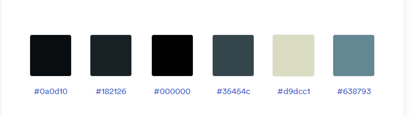

# Gringotts
_Project Briefing_

Gringotts is a fantasy themed banking web application. 

<figure align="center">
 
<figcaption>Gringotts Logo</figcaption>
</figure>

The core of the system is the management of Mages (clients), Accounts and some Operations that can be done: 
* ***Magical Placements*** and ***Magical Retrievals*** (Deposits and Withdraws)
* ***Arcane Transmissions*** (Wire Transfers between accounts)
* ***Dark Pacts*** (Loans)
* ***Coin Transmutation*** (Currency Exchange)

There are two kinds of users:
* **Overseers** (managers): users that can configure the application parameters and operate the application without limits
<figure align="center">
 
<figcaption>Overseer Profile Picture</figcaption>
</figure>

* **Minions** (operators): users that interact with clients and use the application with some limitations
<figure align="center">
 
<figcaption>Minion Profile Picture</figcaption>
</figure>

Gringots uses its own currency consisted of three different coins (in order of increasing value):
* **Knut** (lowest denomination coin)
* **Sickle** equivalent to 29 Knuts
* **Galleon** equivalent to 17 Sickles or 493 Knuts

For simplification and standardization purposes, the Gringotts Administration decided that **all Mage accounts are registered on Sickles**.

For non-magical currency, Gringotts has a variable currency exchange rate for each currency that can change at any time. Currently supported non-magical currencies are: British Pounds, Euros, and American Dollars.

All the application text that represents money must follow this format: **$999,999.00**.

Where "$" is the currency symbol, there is no space between the symbol and the number, comma is the thousands separator and period is decimal separator, the decimal part must show 2 characters even if they are zeroes, and displayed values must be rounded to 2 decimals. If the values are displayed on a table must be right aligned. For example:
|Formated Value|Meaning|
|--:|--|
|Sk$1,245.65|One thousand, two hundred and forty five Sickles with sixty five cents|
|U$D616.00|Six hundred and sixteen American Dolars|
|€1,026,128.50|One millinon, twenty six thousands, one hundred and twenty eight Euros with fifty cents.| 
|£156.87|One hundred and fifty six British Pounds with eighty seven cents|

The following color palette must be used on all the application common components
<figure align="center">
 
<figcaption>Color Palette</figcaption>
</figure>

---
[Back to Index](../README.md)